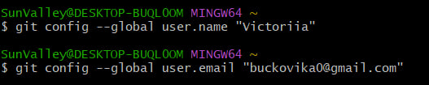
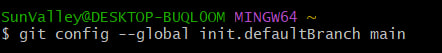
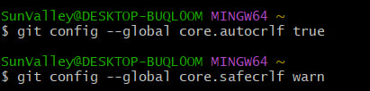

# WorkWithGit

1. Фінальні приготування
1)
Встановлюємо ім'я та адресу електронної пошти
Якщо ви ніколи раніше не використовували Git, для початку вам необхідно здійснити установку. Виконайте наступні команди, щоб Git дізнався про ваше ім'я та електронну пошту. Ці дані використовуються для підпису змін зроблених вами, що дозволить відстежувати, хто і коли зробив зміни в файлі.

Виконайте
git config --global user.name "Your Name"
git config --global user.email "your_email@whatever.com"

2)Назва гілки за замовчуванням
Ми будемо використовувати main як назву гілки за замовчуванням. Щоб налаштувати це, виконайте наступну команду:

Виконайте
git config --global init.defaultBranch main

3)Коректна обробка закінчень рядків
Для користувачів Windows:

Виконайте
git config --global core.autocrlf true
git config --global core.safecrlf warn

2. Створення проєкту
1)Створіть сторінку «Hello, World»
Почніть роботу в порожній директорії (наприклад, repositories, якщо ви завантажили архів з попереднього кроку) зі створення порожньої піддиректорії work, потім перейдіть до неї та створіть файл hello.html з наступним змістом:

Виконайте
mkdir work
cd work
touch hello.html

2)Створіть репозиторій
Зараз у вас є директорія з одним файлом. Щоб створити Git-репозиторій з цієї директорії, виконайте команду git init.

Виконайте
git init

3)Додайте сторінку у репозиторій
Зараз давайте додамо в репозитарій сторінку «Hello, World».

Виконайте
git add hello.html
git commit -m "Initial Commit"
Ви побачите:

